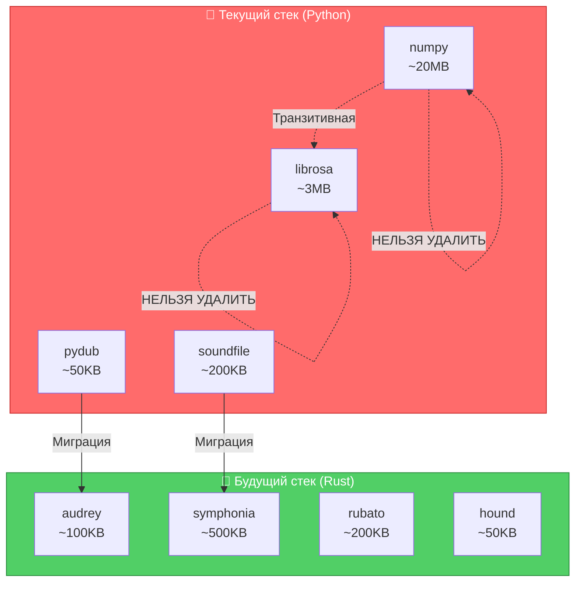
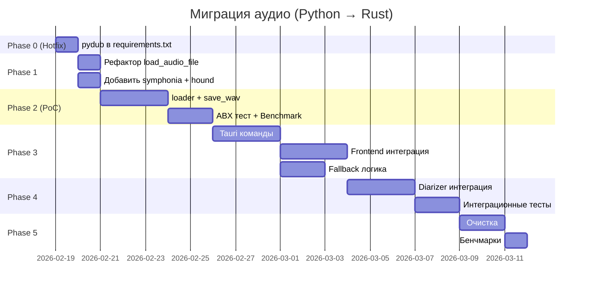

# Миграция Audio: Python → Rust

## Визуальный план и сравнение

> **✅ ОБНОВЛЕНО:** аудит кода 2026-02-19
> Доп. находки: `pydub` ОТСУТСТВУЕТ в requirements.txt (баг!), `load_audio_file()` уже есть в Rust,
> `symphonia` — ОБЯЗАТЕЛЬНА (не опциональна) для MP4/M4A/MKV.



## 📊 Таблица соответствия функций

| Python (сейчас)            | Rust (будет)                   | Статус       | Сложность            |
| -------------------------- | ------------------------------ | ------------ | -------------------- |
| `AudioSegment.from_file()` | `audio::loader::load()`        | 🔜 Не начато | ⭐ Легко             |
| `audio.set_frame_rate()`   | `audio::resampler::resample()` | 🔜 Не начато | ⚠️ Требует ABX теста |
| `audio.set_channels(1)`    | `AudioBuffer::to_mono()`       | 🔜 Не начато | ✅ Тривиально        |
| `sf.read()`                | `audio::loader::load()`        | 🔜 Не начато | ⭐ Легко             |
| `librosa.resample()`       | FFmpeg (уже!)                  | ❌ Не нужно  | —                    |
| `sf.info()`                | `AudioBuffer::duration()`      | 🔜 Не начато | ⭐ Легко             |

> **Примечание 1:** `librosa.resample()` НЕ используется — ресемплинг делается через FFmpeg subprocess.
> **Примечание 2:** прежнее противоречие (`set_frame_rate()` → FFmpeg vs rubato) устранено: используем rubato, при ABX провале — FFmpeg fallback.

## 🗺️ Карта зависимостей

```
ai-engine/
├── utils/audio_intervals.py         ← Заменить soundfile на Rust Tauri команду
│   ├── soundfile.read()            → audio::loader::load()
│   ├── FFmpeg subprocess           → ОСТАВИТЬ (уже работает!)
│   └── sf.info()                   → AudioBuffer::duration()
│
├── diarization/pyannote_diarizer.py  ← ОБЯЗАТЕЛЬНО добавить pydub в requirements.txt!
│   └── AudioSegment.from_file()    → audio::loader::load()
│
└── diarization/sherpa_diarizer.py    ← ОБЯЗАТЕЛЬНО добавить pydub в requirements.txt!
    └── AudioSegment.from_wav()     → audio::loader::load()

src-tauri/src/audio/              ← НОВЫЙ модуль (refactor из transcription_manager.rs)
├── mod.rs                        # Public API
├── loader.rs                     # load_audio_file() + symphonia для MP4/MKV/M4A
├── converter.rs                  # to_whisper_format() — 16kHz mono
├── resampler.rs                  # Rubato (rubato) — только после ABX теста
└── utils.rs                      # duration(), slice()
```

> **Важно:** `audio_intervals.py` НЕ использует librosa! Ресемплинг через FFmpeg.
> **Критично:** `load_audio_file()` уже есть в `transcription_manager.rs` — вынести, не дублировать.

## ⏱️ Timeline по этапам



> **Реальная длительность:** ~18 дней (хотфикс + 17 дней миграции)

## 💾 Сравнение использования памяти

> **⚠️ Уточнено после аудита**

```
Python процесс ( diarization):
┌─────────────────────────────────────┐
│ torch                    ~800MB+    │ ← Основной
│ pyannote.audio           ~200MB     │
│ numpy/scipy              ~50MB      │
│ pydub                    ~5-10MB   │
│ soundfile                ~1-2MB    │
│ librosa                  ~3MB       │
│─────────────────────────────────────│
│ ИТОГО (diarization):    ~1GB+       │
└─────────────────────────────────────┘

Миграция pydub+soundfile → Rust:
┌─────────────────────────────────────┐
│ pydub                    0 (удалён)│
│ soundfile                 0 (удалён)│
│ Rust audio модуль         ~2MB      │
│─────────────────────────────────────│
│ Экономия:               ~250KB     │
└─────────────────────────────────────┘

⚠️ Python всё равно нужен для diarization!
Экономия: ~250KB (а не 21-42MB как планировалось)
```

## 🎯 Чеклист задач

### Phase 0: Hotfix (до начала миграции!)

- [ ] Добавить `pydub>=0.25.1` в `requirements.txt`
- [ ] Проверить: `python -c "import pydub"` в активном venv

### Phase 1: Подготовка (1 день)

- [x] ~~Проверить audio API transcribe-rs~~ — `load_audio_file()` уже есть в `transcription_manager.rs`
- [ ] Добавить в `Cargo.toml`:
  - [ ] `symphonia = { version = "0.5", features = [...] }` (ОБЯЗАТЕЛЬНО — нужен для MP4/M4A)
  - [ ] `hound = "3.5"` (ОБЯЗАТЕЛЬНО — WAV запись)
  - [ ] `rubato = "0.14"` (ОПЦИОНАЛЬНО — после ABX теста)
- [ ] Вынести `load_audio_file()` из `transcription_manager.rs` в `src-tauri/src/audio/`

### Phase 2: PoC + ABX Тест

- [ ] Расширить `loader.rs` — symphonia для MP4/M4A/MKV/OGG
- [ ] Реализовать `save_wav()` через `hound`
- [ ] `AudioBuffer::to_mono()`
- [ ] **ABX тест:** сравнить DER (Ошибка диаризации) Rust vs Python на реальных файлах
- [ ] Написать unit тесты (покрытие >80%)

### Phase 3: Интеграция

- [ ] Создать Tauri команды:
  - [ ] `convert_audio_to_wav`
  - [ ] `get_audio_duration`
  - [ ] `extract_audio_segment`
- [ ] Обновить фронтенд TypeScript типы
- [ ] Fallback: Rust ошибка → Python автоматически

### Phase 4: Миграция Python

- [ ] Обновить `audio_intervals.py` — `soundfile` → Rust
- [ ] Обновить `pyannote_diarizer.py` — `pydub` → Rust
- [ ] Обновить `sherpa_diarizer.py` — `pydub` → Rust
- [ ] Проверить что DER не ухудшился
- [ ] Интеграционные тесты

### Phase 5: Очистка

> **⚠️ librosa НЕЛЬЗЯ удалить!**

- [ ] Удалить из `requirements.txt`:
  - [x] ~~`librosa==0.10.1`~~ → НЕЛЬЗЯ (транзитивная зависимость)
  - [ ] `pydub>=0.25.1` (после замены всего использования)
  - [ ] `soundfile==0.12.1`
- [ ] Обновить документацию
- [ ] Performance бенчмарки

## 📈 Ожидаемые результаты

> **⚠️ Уточнено после аудита**

### Реальная производительность:

> **Числа — после PoC бенчмарка, не до.**

| Операция          | Python | Rust | Ускорение |
| ----------------- | ------ | ---- | --------- |
| Загрузка WAV      | TBD    | TBD  | TBD       |
| Конвертация в WAV | TBD    | TBD  | TBD       |
| Stereo→Mono       | TBD    | TBD  | ≥ 2x      |

> FFmpeg subprocess уже используется — основное улучшение от устранения Python overhead.

### Реальная экономия зависимостей:

| Показатель         | Сейчас                             | После миграции               | Улучшение  |
| ------------------ | ---------------------------------- | ---------------------------- | ---------- |
| Удаляемые          | pydub (~50KB) + soundfile (~200KB) | 0                            | ~250KB     |
| Сохраняются        | librosa, numpy, scipy, torch       | librosa, numpy, scipy, torch | ❌         |
| **Итого экономия** |                                    |                              | **~250KB** |

### ⚠️ Python всё равно нужен для:

- PyAnnote.audio (speaker diarization)
- Sherpa-ONNX (speaker diarization)
- torch (ML framework)

## 🔗 Связанные документы

- [Детальный план](./python-to-rust-audio-migration-plan.md) - Полное описание
- [V3 Performance Plan](./v3-performance-optimization-plan.md) - Общая оптимизация
- [Rust Backend Guide](../rust-backend-fixes.md) - Текущий Rust стек

---

**Создано:** 2025-02-19
**Обновлено:** 2026-02-19 (аудит кода)
**Статус:** ✅ Актуален, готов к реализации
**Следующий шаг:** Hotfix — добавить `pydub>=0.25.1` в `requirements.txt`

```

```
