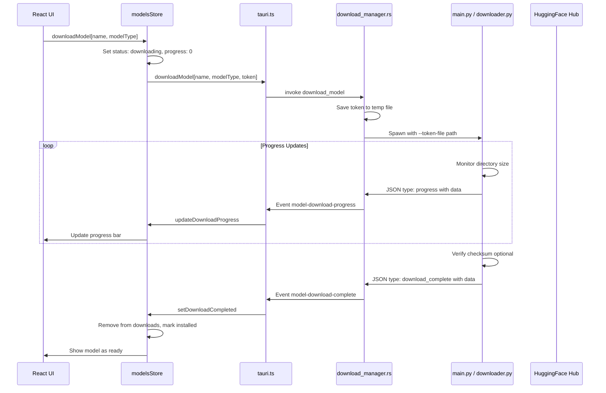

# План исправления системы скачивания моделей

## Источники и способы скачивания

| Тип модели | Источник | Способ | Токен HF | Статус |
|------------|----------|--------|----------|--------|
| **Whisper** | HuggingFace - Systran/faster-whisper-* | snapshot_download | Не нужен | ✅ Работает |
| **Parakeet** | HuggingFace - nvidia/parakeet-* | snapshot_download | Не нужен | ✅ Работает |
| **pyannote-diarization** | HuggingFace - pyannote/segmentation + embedding | Multi-stage download | **Обязателен** | ❌ Сломано |
| **sherpa-onnx-diarization** | GitHub Releases | HTTP download | Не нужен | ⚠️ Частично |

### Особенности по источникам:

1. **Whisper/Parakeet (HuggingFace без токена)** - работают, так как публичные репозитории
2. **pyannote-diarization** - **КРИТИЧНАЯ ПРОБЛЕМА**: требует HuggingFace токен для gated models, но токен не передаётся
3. **sherpa-onnx-diarization** - скачивание с GitHub, может работать, но нет проверки целостности
4. **Multi-stage загрузка** - для диаризации скачиваются 2 модели подряд, UI может некорректно отображать прогресс

---

## Выявленные проблемы

После анализа кода выявлены следующие корневые причины проблем:

### 0. 🚨 КРИТИЧНО: Несовпадение путей скачивания и загрузки моделей
**Файлы:** 
- Скачивание: [`ai-engine/main.py:2059-2063`](ai-engine/main.py:2059-2063)
- Загрузка: [`ai-engine/models/whisper.py:78-83`](ai-engine/models/whisper.py:78-83)

**Суть проблемы:**
```
СКАЧИВАНИЕ (main.py):
  snapshot_download(repo_id="Systran/faster-whisper-base", local_dir="cache_dir/whisper-base/")
  → Создаёт: cache_dir/whisper-base/model.bin, config.json, etc.

ЗАГРУЗКА (whisper.py):
  FasterWhisperModel("base", download_root="cache_dir")
  → Ищет модель в: cache_dir/models--Systran--faster-whisper-base/ (HuggingFace cache structure)
  → НЕ НАХОДИТ и скачивает ЗАНОВО!
```

**Решение:**
В `whisper.py` нужно передавать **полный путь** к скачанной модели:
```python
# ДО:
FasterWhisperModel(model_name, device=self.device, download_root=self.download_root)

# ПОСЛЕ:
model_path = os.path.join(self.download_root, f"whisper-{self.model_size}")
FasterWhisperModel(model_path, device=self.device)
```

**Это объясняет жалобу пользователя: "скачанные модели не подгружаются"**

### 1. Race Condition в modelsStore.ts
**Файл:** [`src/stores/modelsStore.ts`](src/stores/modelsStore.ts:186-202)

```typescript
// ПРОБЛЕМА: downloadModel завершается сразу после invoke, но статус ставится completed
const result = await downloadModel(name, modelType, huggingFaceToken);
set((state) => ({
  downloads: {
    ...state.downloads,
    [name]: { ...state.downloads[name], status: "completed", progress: 100 },
  },
}));
```

**Суть:** `invoke("download_model")` только **запускает** процесс скачивания и возвращает success сразу. Store помечает загрузку completed до реального завершения.

### 2. HuggingFace токен не передаётся
**Файл:** [`src-tauri/src/download_manager.rs`](src-tauri/src/download_manager.rs:283)

```rust
let token_file = None; // TODO: Handle token if needed  <-- ВСЕГДА NONE!
```

Токен не передаётся из TypeScript → Rust → Python, поэтому pyannote модели нельзя скачать.

### 3. Несоответствие типов событий
- Python [`downloader.py:786`](ai-engine/downloader.py:786) отправляет `"type": "DownloadComplete"`
- Python [`main.py:662`](ai-engine/main.py:662) отправляет `"type": "download_complete"` (lowercase!)
- Rust [`download_manager.rs:490`](src-tauri/src/download_manager.rs:490) ожидает `"DownloadComplete"`

### 4. Нет проверки целостности
Метод `compute_checksum` в [`downloader.py:196`](ai-engine/downloader.py:196) существует, но не используется.

### 5. Дублирование логики завершения
- `downloadModel` в store ставит `status: "completed"` после API call
- `setDownloadCompleted` также ставит completed по событию
- Конфликт!

---

## Архитектура исправленной системы



---

## План исправлений

### Этап 1: Исправление Race Condition в Frontend

**Файл:** `src/stores/modelsStore.ts`

Изменить функцию `downloadModel`:
- Убрать установку `status: "completed"` после вызова API
- Оставить только `status: "downloading"`
- Завершение происходит через событие `model-download-complete`

```typescript
// ДО:
const result = await downloadModel(name, modelType, huggingFaceToken);
set((state) => ({ downloads: { ...state.downloads, [name]: { status: "completed" }}}));

// ПОСЛЕ:
await downloadModel(name, modelType, huggingFaceToken);
// Не меняем статус - ждём событие model-download-complete
```

### Этап 2: Передача HuggingFace токена

**Файл:** `src-tauri/src/download_manager.rs`

1. Добавить параметр `hugging_face_token` в `spawn_download`
2. Сохранять токен во временный файл
3. Передавать путь к файлу через `--token-file`

```rust
// В queue_download сохранить токен
let token_path = app.path().app_data_dir()?.join("hf_token.tmp");
std::fs::write(&token_path, hugging_face_token.unwrap_or_default())?;

// В spawn_download передать путь
cmd.arg("--token-file").arg(token_path.to_string_lossy().to_string());
```

### Этап 3: Унификация типов событий

**Файл:** `ai-engine/main.py`

Заменить `download_complete` на `DownloadComplete`:
```python
# ДО:
data = {"type": "download_complete", ...}

# ПОСЛЕ:
data = {"type": "DownloadComplete", ...}
```

### Этап 4: Добавление проверки целостности

**Файл:** `ai-engine/downloader.py`

1. Добавить словарь ожидаемых checksum для моделей
2. Проверять после скачивания

```python
MODEL_CHECKSUMS = {
    "whisper-base": "abc123...",  # SHA256
    # ...
}

def verify_model_checksum(model_path: Path, expected: str) -> bool:
    actual = self.compute_checksum(model_path)
    return actual == expected
```

### Этап 5: Улучшение обработки ошибок

**Файл:** `src/stores/modelsStore.ts`

Добавить таймаут для зависших загрузок:
```typescript
const DOWNLOAD_TIMEOUT = 30 * 60 * 1000; // 30 минут

setTimeout(() => {
  if (download.status === "downloading") {
    setDownloadError(modelName, "Download timeout");
  }
}, DOWNLOAD_TIMEOUT);
```

---

## Детальный список изменений

### 1. src/stores/modelsStore.ts
- [ ] Убрать `status: "completed"` после `downloadModel` API call
- [ ] Добавить таймаут для зависших загрузок
- [ ] Улучшить логирование прогресса

### 2. src-tauri/src/download_manager.rs
- [ ] Добавить передачу `hugging_face_token` в `spawn_download`
- [ ] Сохранять токен во временный файл перед запуском Python
- [ ] Добавить cleanup временного файла после завершения

### 3. ai-engine/main.py
- [ ] Унифицировать `download_complete` → `DownloadComplete`
- [ ] Улучшить обработку ошибок при чтении токена

### 4. ai-engine/downloader.py
- [ ] Добавить словарь `MODEL_CHECKSUMS`
- [ ] Добавить опциональную проверку checksum после скачивания
- [ ] Добавить retry логику при неудачной проверке

### 5. src/services/tauri.ts
- [ ] Добавить типизацию для всех событий скачивания
- [ ] Улучшить обработку ошибок

### 6. src/components/features/ModelCard.tsx
- [ ] Добавить отображение ETA (время до завершения) на основе скорости
- [ ] Добавить индикатор зависания если прогресс не меняется 10+ секунд
- [ ] Улучшить визуализацию multi-stage загрузки - показать оба этапа сразу
- [ ] Добавить анимацию пульсации для активной загрузки

### 7. src/types/index.ts
- [ ] Добавить поле `eta` в ModelDownloadState
- [ ] Добавить поле `lastProgressUpdate` для отслеживания зависаний

---

## Приоритет исправлений

0. **🚨 КРИТИЧНО:** Несовпадение путей скачивания и загрузки (модели "не цепляются" после скачивания!)
1. **Критично:** Race Condition в modelsStore.ts (ломает UI)
2. **Критично:** Передача HuggingFace токена (ломает pyannote)
3. **Важно:** Унификация типов событий (ломает завершение)
4. **Желательно:** Проверка целостности (надёжность)
5. **Желательно:** Таймауты и обработка ошибок (UX)

---

## Тестирование

После исправлений протестировать:

1. Скачивание whisper-base (без токена)
2. Скачивание pyannote-diarization (с токеном)
3. Отмена загрузки
4. Повторное скачивание после ошибки
5. Перезапуск приложения во время загрузки
