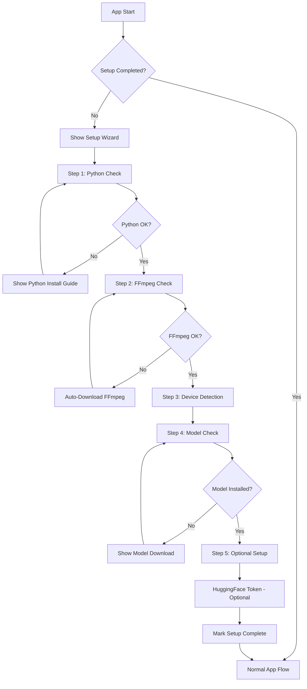

# First-Launch Setup Wizard - Architecture Plan

## Overview

Create a comprehensive first-launch setup wizard that checks all required dependencies and guides the user through installation if needed. The wizard should provide a clear, step-by-step interface showing the status of each component.

## Components to Check

### 1. Python Environment
- **Python version**: Must be 3.10-3.12 (3.13+ NOT supported)
- **Virtual environment**: Recommended but optional
- **PyTorch**: Must be installed with correct CUDA/MPS/CPU support

### 2. FFmpeg
- Required for audio/video processing
- Can be auto-downloaded and installed

### 3. AI Models
- At least one transcription model must be installed
- Options: Whisper, Distil-Whisper, Parakeet

### 4. Optional Components
- **HuggingFace Token**: Required for PyAnnote diarization
- **CUDA**: For NVIDIA GPU acceleration
- **MPS**: For Apple Silicon acceleration

## Architecture



## Data Types

### TypeScript Types

```typescript
// src/types/setup.ts

export type SetupStep = 
  | 'python'
  | 'ffmpeg'
  | 'device'
  | 'model'
  | 'optional';

export type CheckStatus = 
  | 'pending'
  | 'checking'
  | 'ok'
  | 'warning'
  | 'error'
  | 'installing';

export interface PythonCheckResult {
  status: CheckStatus;
  version: string | null;
  executable: string | null;
  inVenv: boolean;
  pytorchInstalled: boolean;
  pytorchVersion: string | null;
  cudaAvailable: boolean;
  mpsAvailable: boolean;
  message: string;
}

export interface FFmpegCheckResult {
  status: CheckStatus;
  installed: boolean;
  path: string | null;
  version: string | null;
  message: string;
}

export interface DeviceCheckResult {
  status: CheckStatus;
  devices: DeviceInfo[];
  recommended: DeviceInfo | null;
  message: string;
}

export interface ModelCheckResult {
  status: CheckStatus;
  installedModels: LocalModel[];
  hasRequiredModel: boolean;
  message: string;
}

export interface SetupWizardState {
  currentStep: SetupStep;
  isComplete: boolean;
  python: PythonCheckResult | null;
  ffmpeg: FFmpegCheckResult | null;
  device: DeviceCheckResult | null;
  model: ModelCheckResult | null;
  huggingFaceToken: string | null;
}
```

## Backend API

### Python Engine Endpoints

Add to `ai-engine/main.py`:

```python
# New IPC command types
def check_python_environment():
    """Check Python version, PyTorch, and virtual environment status."""
    # Returns PythonCheckResult as JSON

def check_ffmpeg():
    """Check FFmpeg installation."""
    # Returns FFmpegCheckResult as JSON

def check_models():
    """Check installed AI models."""
    # Returns ModelCheckResult as JSON

def get_full_environment_status():
    """Get all environment checks in one call."""
    # Returns combined status for all checks
```

### Rust/Tauri Commands

Add to `src-tauri/src/lib.rs`:

```rust
#[tauri::command]
async fn check_python_environment() -> Result<PythonCheckResult, String>;

#[tauri::command]
async fn check_ffmpeg_status() -> Result<FFmpegCheckResult, String>;

#[tauri::command]
async fn check_models_status() -> Result<ModelCheckResult, String>;

#[tauri::command]
async fn get_setup_status() -> Result<SetupWizardState, String>;

#[tauri::command]
async fn mark_setup_complete() -> Result<(), String>;

#[tauri::command]
async fn is_setup_complete() -> Result<bool, String>;
```

## UI Components

### SetupWizard Component

```
src/components/features/SetupWizard/
├── SetupWizard.tsx          # Main wizard container
├── SetupStep.tsx            # Individual step renderer
├── steps/
│   ├── PythonStep.tsx       # Python environment check
│   ├── FFmpegStep.tsx       # FFmpeg check and download
│   ├── DeviceStep.tsx       # Device detection display
│   ├── ModelStep.tsx        # Model download step
│   └── OptionalStep.tsx     # HuggingFace token, etc.
├── CheckCard.tsx            # Reusable status card
├── ProgressBar.tsx          # Step progress indicator
└── index.ts
```

### UI Design

```
┌─────────────────────────────────────────────────────────────┐
│  🚀 First-Time Setup                                         │
│                                                              │
│  Step 1 of 5: Python Environment                            │
│  ━━━━━━━━━━━━━━━━━━━━━○○○○○○○○○○○○○○○○○○○○○○○○○○○○○○○○○○   │
│                                                              │
│  ┌──────────────────────────────────────────────────────┐   │
│  │ ✅ Python 3.10.12                                     │   │
│  │    /usr/bin/python3                                   │   │
│  │                                                       │   │
│  │ ✅ PyTorch 2.5.1+cu121                               │   │
│  │    CUDA support enabled                               │   │
│  │                                                       │   │
│  │ ⚠️  Virtual environment not detected                  │   │
│  │    (Recommended but optional)                         │   │
│  └──────────────────────────────────────────────────────┘   │
│                                                              │
│                                    [Continue →]              │
└─────────────────────────────────────────────────────────────┘
```

## State Management

### Zustand Store for Setup

```typescript
// src/stores/setupStore.ts

interface SetupStore {
  // State
  currentStep: SetupStep;
  isComplete: boolean;
  isChecking: boolean;
  
  // Check results
  pythonCheck: PythonCheckResult | null;
  ffmpegCheck: FFmpegCheckResult | null;
  deviceCheck: DeviceCheckResult | null;
  modelCheck: ModelCheckResult | null;
  
  // Actions
  checkAll: () => Promise<void>;
  checkPython: () => Promise<void>;
  checkFFmpeg: () => Promise<void>;
  checkDevice: () => Promise<void>;
  checkModel: () => Promise<void>;
  
  // Navigation
  nextStep: () => void;
  prevStep: () => void;
  goToStep: (step: SetupStep) => void;
  
  // Completion
  completeSetup: () => Promise<void>;
  skipSetup: () => void;
}
```

## Implementation Steps

### Phase 1: Backend Infrastructure
1. Create Python environment check endpoint
2. Create Rust commands for setup wizard
3. Add setup completion persistence

### Phase 2: UI Components
4. Create SetupWizard container component
5. Create individual step components
6. Create CheckCard reusable component
7. Add progress indicator

### Phase 3: Integration
8. Integrate into App.tsx startup flow
9. Add setup completion check on app start
10. Add skip/re-run setup options in settings

### Phase 4: Polish
11. Add error handling and retry logic
12. Add loading states and animations
13. Add helpful error messages with solutions

## Error Handling

### Common Issues and Solutions

| Issue | Solution |
|-------|----------|
| Python 3.13+ detected | Show download link for Python 3.12 |
| PyTorch not installed | Provide pip install command |
| CUDA not available | Suggest CUDA toolkit installation |
| FFmpeg not found | Auto-download or manual install option |
| No models installed | Guide to model download page |

## Persistence

Store setup completion status in:
- **Tauri**: Use app data directory with a `.setup_complete` file
- **Fallback**: localStorage for web mode

```rust
// Store setup completion in app data dir
fn get_setup_flag_path() -> PathBuf {
    app_data_dir().join(".setup_complete")
}
```

## Settings Integration

Add option in settings to re-run setup wizard:

```typescript
// In SettingsPanel.tsx
<button onClick={() => resetSetup()}>
  Re-run Setup Wizard
</button>
```

## Testing Checklist

- [ ] Fresh install flow (no dependencies)
- [ ] Partial setup (some dependencies exist)
- [ ] Full setup (all dependencies exist)
- [ ] Skip setup and use app anyway
- [ ] Re-run setup from settings
- [ ] Error recovery (network issues, etc.)
- [ ] Different platforms (Windows, macOS, Linux)

## Overview

Create a comprehensive first-launch setup wizard that checks all required dependencies and guides the user through installation if needed. The wizard should provide a clear, step-by-step interface showing the status of each component.

## Components to Check

### 1. Python Environment
- **Python version**: Must be 3.10-3.12 (3.13+ NOT supported)
- **Virtual environment**: Recommended but optional
- **PyTorch**: Must be installed with correct CUDA/MPS/CPU support

### 2. FFmpeg
- Required for audio/video processing
- Can be auto-downloaded and installed

### 3. AI Models
- At least one transcription model must be installed
- Options: Whisper, Distil-Whisper, Parakeet

### 4. Optional Components
- **HuggingFace Token**: Required for PyAnnote diarization
- **CUDA**: For NVIDIA GPU acceleration
- **MPS**: For Apple Silicon acceleration

## Architecture


## Data Types

### TypeScript Types

```typescript
// src/types/setup.ts

export type SetupStep = 
  | 'python'
  | 'ffmpeg'
  | 'device'
  | 'model'
  | 'optional';

export type CheckStatus = 
  | 'pending'
  | 'checking'
  | 'ok'
  | 'warning'
  | 'error'
  | 'installing';

export interface PythonCheckResult {
  status: CheckStatus;
  version: string | null;
  executable: string | null;
  inVenv: boolean;
  pytorchInstalled: boolean;
  pytorchVersion: string | null;
  cudaAvailable: boolean;
  mpsAvailable: boolean;
  message: string;
}

export interface FFmpegCheckResult {
  status: CheckStatus;
  installed: boolean;
  path: string | null;
  version: string | null;
  message: string;
}

export interface DeviceCheckResult {
  status: CheckStatus;
  devices: DeviceInfo[];
  recommended: DeviceInfo | null;
  message: string;
}

export interface ModelCheckResult {
  status: CheckStatus;
  installedModels: LocalModel[];
  hasRequiredModel: boolean;
  message: string;
}

export interface SetupWizardState {
  currentStep: SetupStep;
  isComplete: boolean;
  python: PythonCheckResult | null;
  ffmpeg: FFmpegCheckResult | null;
  device: DeviceCheckResult | null;
  model: ModelCheckResult | null;
  huggingFaceToken: string | null;
}
```

## Backend API

### Python Engine Endpoints

Add to `ai-engine/main.py`:

```python
# New IPC command types
def check_python_environment():
    """Check Python version, PyTorch, and virtual environment status."""
    # Returns PythonCheckResult as JSON

def check_ffmpeg():
    """Check FFmpeg installation."""
    # Returns FFmpegCheckResult as JSON

def check_models():
    """Check installed AI models."""
    # Returns ModelCheckResult as JSON

def get_full_environment_status():
    """Get all environment checks in one call."""
    # Returns combined status for all checks
```

### Rust/Tauri Commands

Add to `src-tauri/src/lib.rs`:

```rust
#[tauri::command]
async fn check_python_environment() -> Result<PythonCheckResult, String>;

#[tauri::command]
async fn check_ffmpeg_status() -> Result<FFmpegCheckResult, String>;

#[tauri::command]
async fn check_models_status() -> Result<ModelCheckResult, String>;

#[tauri::command]
async fn get_setup_status() -> Result<SetupWizardState, String>;

#[tauri::command]
async fn mark_setup_complete() -> Result<(), String>;

#[tauri::command]
async fn is_setup_complete() -> Result<bool, String>;
```

## UI Components

### SetupWizard Component

```
src/components/features/SetupWizard/
├── SetupWizard.tsx          # Main wizard container
├── SetupStep.tsx            # Individual step renderer
├── steps/
│   ├── PythonStep.tsx       # Python environment check
│   ├── FFmpegStep.tsx       # FFmpeg check and download
│   ├── DeviceStep.tsx       # Device detection display
│   ├── ModelStep.tsx        # Model download step
│   └── OptionalStep.tsx     # HuggingFace token, etc.
├── CheckCard.tsx            # Reusable status card
├── ProgressBar.tsx          # Step progress indicator
└── index.ts
```

### UI Design

```
┌─────────────────────────────────────────────────────────────┐
│  🚀 First-Time Setup                                         │
│                                                              │
│  Step 1 of 5: Python Environment                            │
│  ━━━━━━━━━━━━━━━━━━━━━○○○○○○○○○○○○○○○○○○○○○○○○○○○○○○○○○○   │
│                                                              │
│  ┌──────────────────────────────────────────────────────┐   │
│  │ ✅ Python 3.10.12                                     │   │
│  │    /usr/bin/python3                                   │   │
│  │                                                       │   │
│  │ ✅ PyTorch 2.5.1+cu121                               │   │
│  │    CUDA support enabled                               │   │
│  │                                                       │   │
│  │ ⚠️  Virtual environment not detected                  │   │
│  │    (Recommended but optional)                         │   │
│  └──────────────────────────────────────────────────────┘   │
│                                                              │
│                                    [Continue →]              │
└─────────────────────────────────────────────────────────────┘
```

## State Management

### Zustand Store for Setup

```typescript
// src/stores/setupStore.ts

interface SetupStore {
  // State
  currentStep: SetupStep;
  isComplete: boolean;
  isChecking: boolean;
  
  // Check results
  pythonCheck: PythonCheckResult | null;
  ffmpegCheck: FFmpegCheckResult | null;
  deviceCheck: DeviceCheckResult | null;
  modelCheck: ModelCheckResult | null;
  
  // Actions
  checkAll: () => Promise<void>;
  checkPython: () => Promise<void>;
  checkFFmpeg: () => Promise<void>;
  checkDevice: () => Promise<void>;
  checkModel: () => Promise<void>;
  
  // Navigation
  nextStep: () => void;
  prevStep: () => void;
  goToStep: (step: SetupStep) => void;
  
  // Completion
  completeSetup: () => Promise<void>;
  skipSetup: () => void;
}
```

## Implementation Steps

### Phase 1: Backend Infrastructure
1. Create Python environment check endpoint
2. Create Rust commands for setup wizard
3. Add setup completion persistence

### Phase 2: UI Components
4. Create SetupWizard container component
5. Create individual step components
6. Create CheckCard reusable component
7. Add progress indicator

### Phase 3: Integration
8. Integrate into App.tsx startup flow
9. Add setup completion check on app start
10. Add skip/re-run setup options in settings

### Phase 4: Polish
11. Add error handling and retry logic
12. Add loading states and animations
13. Add helpful error messages with solutions

## Error Handling

### Common Issues and Solutions

| Issue | Solution |
|-------|----------|
| Python 3.13+ detected | Show download link for Python 3.12 |
| PyTorch not installed | Provide pip install command |
| CUDA not available | Suggest CUDA toolkit installation |
| FFmpeg not found | Auto-download or manual install option |
| No models installed | Guide to model download page |

## Persistence

Store setup completion status in:
- **Tauri**: Use app data directory with a `.setup_complete` file
- **Fallback**: localStorage for web mode

```rust
// Store setup completion in app data dir
fn get_setup_flag_path() -> PathBuf {
    app_data_dir().join(".setup_complete")
}
```

## Settings Integration

Add option in settings to re-run setup wizard:

```typescript
// In SettingsPanel.tsx
<button onClick={() => resetSetup()}>
  Re-run Setup Wizard
</button>
```

## Testing Checklist

- [ ] Fresh install flow (no dependencies)
- [ ] Partial setup (some dependencies exist)
- [ ] Full setup (all dependencies exist)
- [ ] Skip setup and use app anyway
- [ ] Re-run setup from settings
- [ ] Error recovery (network issues, etc.)
- [ ] Different platforms (Windows, macOS, Linux)

