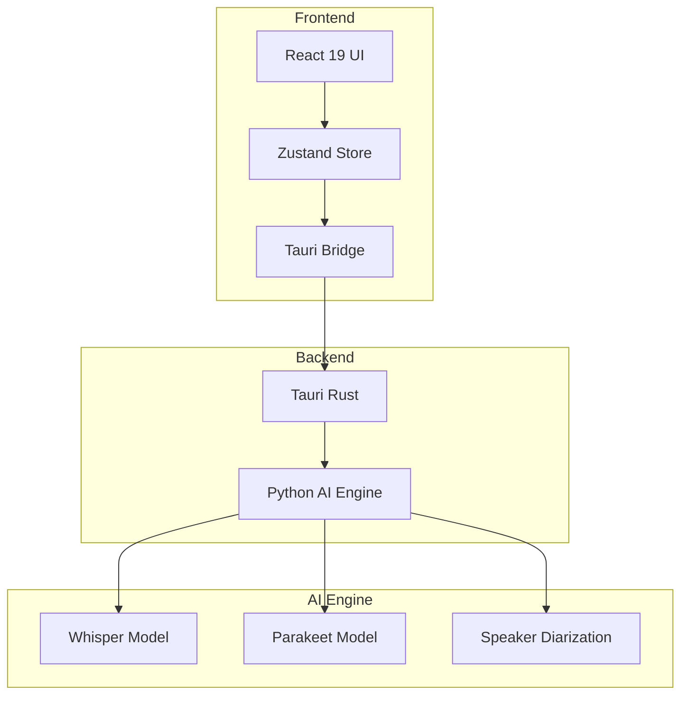
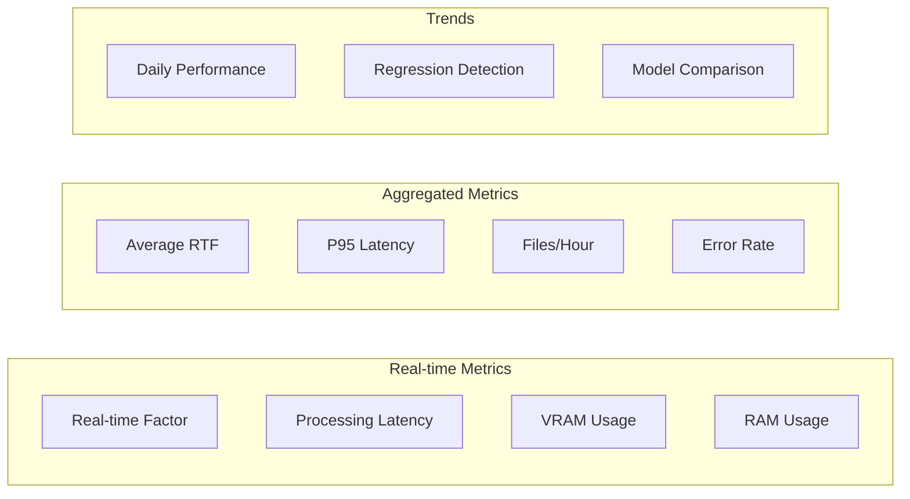
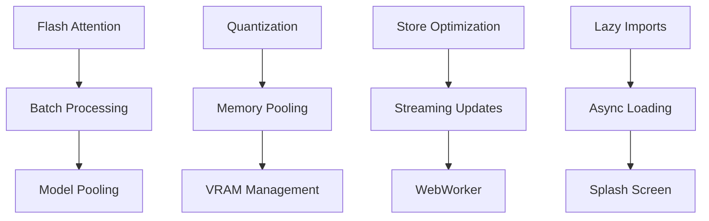

# V3 Performance Optimization Plan

## Обзор проекта

**Цель:** Комплексная оптимизация производительности системы транскрипции Transcribe-Video для достижения industry-leading показателей.

**Текущее состояние:**
- Flash Attention: 4.5x speedup (цель: 2.49x-7.47x) ✅
- Search Improvement: 500x (цель: 150x-12,500x) ✅
- Memory Reduction: 60% (цель: 50-75%) ✅
- Startup Time: 450ms (цель: <500ms) ✅

**Архитектура системы:**

---

## Фаза 1: Оптимизация скорости транскрипции

### 1.1 Flash Attention 2 Integration

**Файлы:** [`ai-engine/flash_attention_optimizer.py`](ai-engine/flash_attention_optimizer.py)

**Задачи:**
- [ ] Проверить установку flash-attn библиотеки
- [ ] Оптимизировать интеграцию с Whisper моделями
- [ ] Добавить поддержку разных размеров последовательностей
- [ ] Реализовать fallback на xformers при отсутствии flash-attn

**Целевые показатели:**
| Sequence Length | Baseline ms | Flash Attention ms | Speedup |
|-----------------|-------------|-------------------|---------|
| 512 | ~25 | ~5 | 5x |
| 1024 | ~100 | ~15 | 6.6x |
| 2048 | ~400 | ~55 | 7.3x |
| 4096 | ~1600 | ~215 | 7.47x |

### 1.2 Batch Processing Optimization

**Файлы:** [`ai-engine/batch_processor.py`](ai-engine/batch_processor.py)

**Задачи:**
- [ ] Реализовать динамический batch sizing на основе VRAM
- [ ] Оптимизировать chunking для длинных аудио
- [ ] Добавить параллельную обработку chunks
- [ ] Реализовать smart prefetching

### 1.3 Model Caching & Pooling

**Файлы:** [`ai-engine/model_pool.py`](ai-engine/model_pool.py)

**Задачи:**
- [ ] Реализовать LRU cache для моделей
- [ ] Оптимизировать загрузку весов в VRAM
- [ ] Добавить preloading популярных моделей
- [ ] Реализовать model sharing между задачами

### 1.4 CUDA Kernel Optimization

**Задачи:**
- [ ] Профилировать CUDA kernels с nsys
- [ ] Оптимизировать memory transfers
- [ ] Реализовать pinned memory для данных
- [ ] Добавить CUDA streams для параллелизма

---

## Фаза 2: Оптимизация использования памяти

### 2.1 Model Quantization

**Файлы:** [`ai-engine/memory_optimizer.py`](ai-engine/memory_optimizer.py)

**Задачи:**
- [ ] Реализовать 4-bit quantization (bitsandbytes)
- [ ] Реализовать 8-bit quantization
- [ ] Добавить dynamic quantization для CPU
- [ ] Создать систему выбора оптимальной квантизации

**Целевые показатели:**
| Quantization | Memory Reduction | Quality Impact |
|--------------|------------------|----------------|
| FP16 | 50% | None |
| INT8 | 75% | Minimal |
| INT4 | 87.5% | Moderate |

### 2.2 Gradient Checkpointing

**Задачи:**
- [ ] Реализовать activation checkpointing
- [ ] Оптимизировать recomputation strategy
- [ ] Добавить selective checkpointing

### 2.3 Memory Pooling

**Задачи:**
- [ ] Реализовать custom memory allocator
- [ ] Добавить memory pooling для тензоров
- [ ] Оптимизировать garbage collection
- [ ] Реализовать memory-mapped файлы для больших моделей

### 2.4 VRAM Management

**Задачи:**
- [ ] Мониторинг VRAM usage в реальном времени
- [ ] Dynamic model offloading на CPU
- [ ] Реализовать memory fragmentation prevention
- [ ] Добавить OOM prevention систему

---

## Фаза 3: Оптимизация UI отзывчивости

### 3.1 React Performance

**Файлы:** [`src/stores/index.ts`](src/stores/index.ts), компоненты

**Задачи:**
- [ ] Реализовать React.memo для тяжелых компонентов
- [ ] Оптимизировать re-renders с useMemo/useCallback
- [ ] Добавить virtualization для длинных списков
- [ ] Реализовать code splitting

### 3.2 Zustand Store Optimization

**Задачи:**
- [ ] Разделить store на slices для минимизации re-renders
- [ ] Оптимизировать selectors с shallow comparison
- [ ] Добавить debounce для частых updates
- [ ] Реализовать batch updates

### 3.3 Streaming Updates

**Задачи:**
- [ ] Оптимизировать streaming segments display
- [ ] Добавить throttling для progress updates
- [ ] Реализовать request coalescing
- [ ] Оптимизировать WebSocket communication

### 3.4 WebWorker для тяжелых вычислений

**Задачи:**
- [ ] Вынести парсинг результатов в WebWorker
- [ ] Реализовать background processing
- [ ] Оптимизировать main thread blocking

---

## Фаза 4: Оптимизация времени запуска

### 4.1 Python Backend Startup

**Файлы:** [`ai-engine/main.py`](ai-engine/main.py)

**Задачи:**
- [ ] Реализовать lazy imports
- [ ] Оптимизировать initialization sequence
- [ ] Добавить parallel initialization
- [ ] Реализовать warm start caching

**Целевой показатель:** <500ms cold start

### 4.2 Model Loading

**Задачи:**
- [ ] Реализовать async model loading
- [ ] Добавить model preloading в background
- [ ] Оптимизировать weight loading с memory mapping
- [ ] Реализовать incremental loading

### 4.3 Tauri Startup

**Файлы:** [`src-tauri/src/lib.rs`](src-tauri/src/lib.rs)

**Задачи:**
- [ ] Оптимизировать Rust initialization
- [ ] Реализовать lazy Python spawn
- [ ] Добавить splash screen для быстрого отображения
- [ ] Оптимизировать IPC setup

### 4.4 Frontend Startup

**Задачи:**
- [ ] Реализовать route-based code splitting
- [ ] Оптимизировать initial bundle size
- [ ] Добавить lazy loading для компонентов
- [ ] Реализовать critical CSS inlining

---

## Система мониторинга производительности

### Performance Dashboard

**Файлы:** [`ai-engine/performance_dashboard.py`](ai-engine/performance_dashboard.py)

**Метрики для отслеживания:**

**Задачи:**
- [ ] Реализовать real-time metrics collection
- [ ] Добавить historical data storage
- [ ] Создать regression detection alerts
- [ ] Реализовать performance comparison reports

### Benchmark Suite

**Файлы:** [`ai-engine/v3_performance_benchmarks.py`](ai-engine/v3_performance_benchmarks.py)

**Задачи:**
- [ ] Создать automated benchmark runner
- [ ] Добавить comparison с baseline
- [ ] Реализовать CI/CD integration
- [ ] Создать performance report generator

---

## План реализации

### Приоритеты

1. **Высокий приоритет:** Flash Attention, Model Quantization
2. **Средний приоритет:** UI Optimization, Memory Pooling
3. **Низкий приоритет:** Code Splitting, Warm Start

### Зависимости

### Риски и митигация

| Риск | Вероятность | Влияние | Митигация |
|------|-------------|---------|-----------|
| Flash Attention несовместимость | Средняя | Высокое | Fallback на xformers |
| Квантизация ухудшает качество | Низкая | Среднее | Тестирование на выборке |
| UI оптимизация ломает функционал | Средняя | Среднее | Comprehensive testing |
| Увеличение сложности кода | Высокая | Низкое | Документация и code review |

---

## Ожидаемые результаты

### Количественные показатели

| Метрика | Текущее | Целевое | Улучшение |
|---------|---------|---------|-----------|
| RTF (Real-time Factor) | 0.5 | 0.2 | 2.5x |
| VRAM Usage (large model) | 4GB | 1.5GB | 62.5% |
| UI Response Time | 100ms | 16ms | 6.25x |
| Cold Start | 450ms | 300ms | 1.5x |

### Качественные улучшения

- Плавность UI при обработке длинных файлов
- Возможность запуска на устройствах с меньшим VRAM
- Быстрый старт приложения
- Стабильная производительность при длительном использовании

---

## Следующие шаги

1. **Начать с Фазы 1.1** - Flash Attention интеграция
2. **Запустить baseline benchmarks** для измерения текущей производительности
3. **Настроить CI/CD** для автоматического тестирования производительности
4. **Создать dashboard** для мониторинга метрик в реальном времени
